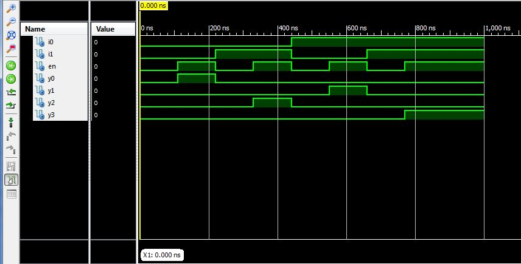
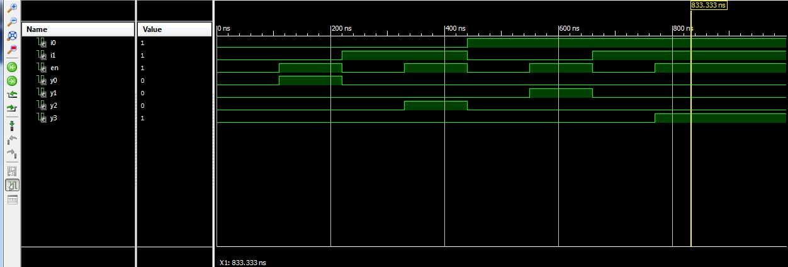

ECE281_CE2
==========

##Structural Design

###Description

The structural design process took advantage of components
in the final top level design. This style of design is 
reminiscent of the kind of encapsulation found in object oriented
programming and just as powerful. It will allow us to scale up simple
components into complex, powerful components like a CPU. Two
components were defined, and3 and inverter. Although the function
of these components were already available in vanilla VHDL it 
demonstrated the idea of structural design.

###Testing

The following truth table was created to describe the behavior of 
the decoder:

| I0 | I1 | EN | Y0 | Y1 | Y2 | Y3 |
|---|---|---|   ---|---|---|---|
| 0 | 0 | 0 |    0 | 0 | 0 | 0 |
| 0 | 0 | 1 |    1 | 0 | 0 | 0 |
| 0 | 1 | 0 |    0 | 0 | 0 | 0 |
| 0 | 1 | 1 |    0 | 0 | 1 | 0 |
| 1 | 0 | 0 |    0 | 0 | 0 | 0 |
| 1 | 0 | 1 |    0 | 1 | 0 | 0 |
| 1 | 1 | 0 |    0 | 0 | 0 | 0 |
| 1 | 1 | 1 |    0 | 0 | 0 | 1 |

Then a self-checking testbench was designed to test the design for
each combination of I0, I1, and EN for the outputs described above. 
In testing the testbench did not raise any errors meaning the design
behavior was the same as the theoretical behavior. Below is a screenshot
of the testbench results in Isim. 

Inline-style: 

##Behavioral Design

###Description

The behavioral design process is the first method of design we have
practiced in VHDL. IT represents what is going on inside the chip 
wire by wire, without abstraction or encapsulation. This makes
it much more cumbersome on large designs. 

###Testing

The same self-checking testbench was used to test the functionality
of the behavioral design. The testbench did not raise any errors
meaning that the behavioral design was also successful. Below is a
screenshot of the testbench results.

Inline-style: 

##Decoder Research

According to wikipedia, a decoder is a device that performs the
opposite operation of a encoder, meaning that a decoder reads 
information rather than writing information to memory. This device
is very important to CPU design because it can be used to read 
program instructions for the CPU to execute. 
